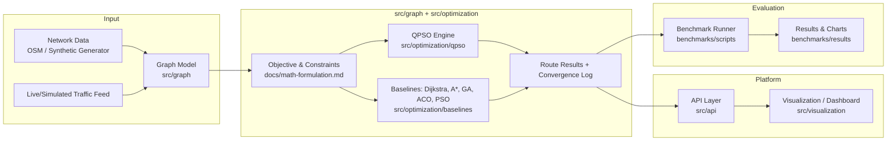

# System Architecture

## Component Overview

## Layers

1. **Input layer** — synthetic graph generator (`data/synthetic`) and real-world network importer (`data/real_world`, OpenStreetMap-based), plus a traffic-weight simulator/feed.
2. **Modeling layer** (`src/graph`) — graph construction, dynamic edge-weight updates, adjacency utilities.
3. **Formulation layer** (`docs/math-formulation.md`) — objective function and constraints shared by every solver so comparisons are apples-to-apples.
4. **Optimization layer** (`src/optimization`) — the QPSO engine plus baseline solvers behind one common solver interface.
5. **Platform layer** (`src/api`, `src/visualization`) — a thin API that accepts a network + traffic snapshot and returns optimized routes, rendered on a map/graph view.
6. **Evaluation layer** (`benchmarks/`) — scripted sweeps across problem sizes, collecting solution quality, runtime, and convergence-speed metrics into `benchmarks/results`.

## Solver Interface Contract

Every solver (QPSO and each baseline) implements the same contract so benchmarking is a drop-in swap:

- **Input:** graph snapshot, vehicle/capacity constraints, time windows, depot(s).
- **Output:** route set, total cost (time/distance/congestion-weighted), iterations-to-convergence, wall-clock time.
