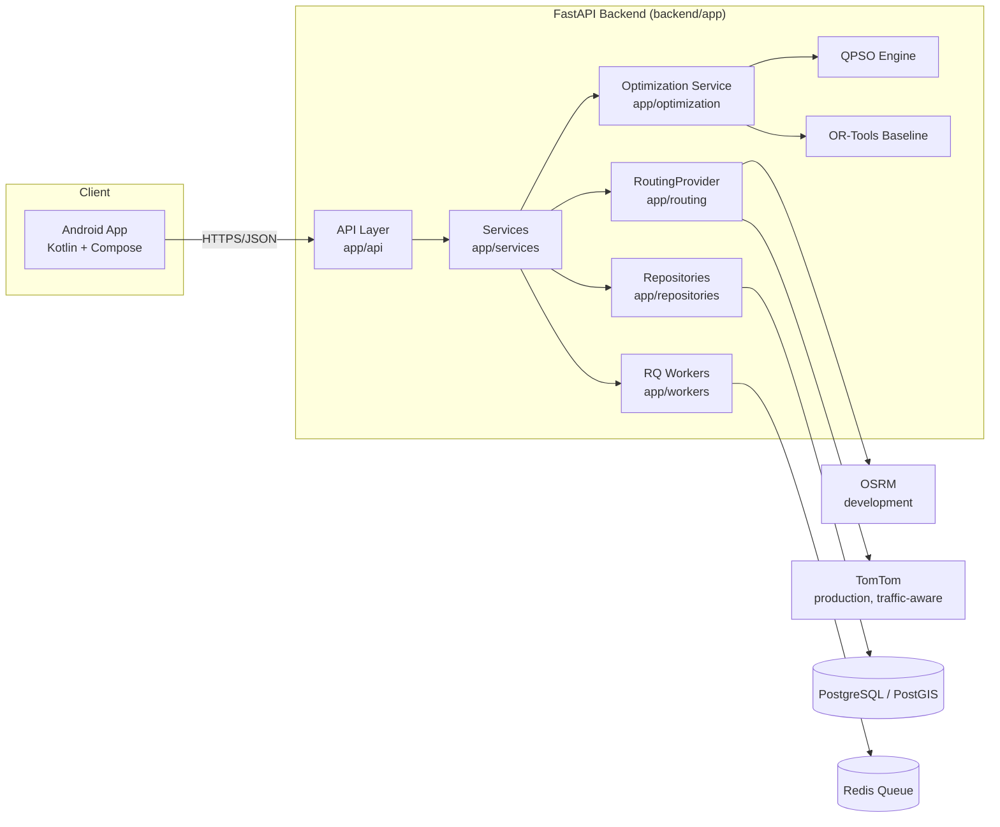

# System Architecture

## Component Overview

## Layers

1. **Client layer** (`android/`) — Kotlin/Compose app; contains no API secrets, talks to the backend over HTTPS/JSON only.
2. **API layer** (`backend/app/api`) — versioned FastAPI routers; input validation, predictable response shapes, no leaked internals.
3. **Service layer** (`backend/app/services`) — business logic; orchestrates routing, optimization, and persistence. UI/API code never implements optimization or routing logic directly (CLAUDE.md §6.2).
4. **Routing layer** (`backend/app/routing`) — `RoutingProvider` abstraction (`geocode`, `route`, `matrix`) with `OSRMProvider` (development) and a future `TomTomProvider` (production, traffic-aware). Provider-specific logic stays inside this layer only (CLAUDE.md §6.3).
5. **Optimization layer** (`backend/app/optimization`) — QPSO engine plus an OR-Tools classical baseline, both operating on the distance/time matrix a `RoutingProvider` returns, applied to TSP/VRP/CVRP/CVRPTW problem instances (CLAUDE.md §8).
6. **Persistence layer** (`backend/app/models`, `backend/app/repositories`) — SQLAlchemy models for the domain entities (User, Vehicle, Depot, DeliveryStop, Route, OptimizationJob, TrafficSnapshot) backed by PostgreSQL/PostGIS, with Alembic migrations.
7. **Background jobs** (`backend/app/workers`) — Redis + RQ workers for long-running optimization jobs so the API request path never blocks on optimization (CLAUDE.md §15, §25).

## Why routing is delegated, not built in-house

An earlier version of this document (and the original hackathon framing)
proposed a custom weighted-graph engine with in-house Dijkstra/A* shortest
paths, benchmarked against GA/ACO/PSO. The production architecture in
[CLAUDE.md](../CLAUDE.md) instead delegates all road-network routing to
external providers (OSRM/TomTom) via the `RoutingProvider` interface, and
scopes QPSO/OR-Tools to the VRP-style stop-ordering problem on top of the
resulting distance/time matrix. This avoids maintaining a bespoke routing
engine and keeps QTrace's optimization core focused on fleet/route
intelligence rather than road-graph shortest-path computation.

## RoutingProvider Contract

- **`geocode(address) -> Coordinate`** — resolve free text to a coordinate. Not every provider supports this (e.g. OSRM does not; a geocoding-capable provider must be configured separately).
- **`route(coordinates) -> RouteResult`** — road-network route through an ordered list of coordinates: distance, duration, geometry.
- **`matrix(coordinates) -> MatrixResult`** — full pairwise distance/duration matrix, the primary input to the optimization layer.

Coordinate ordering is `(latitude, longitude)` everywhere in QTrace's own
schemas; providers with a different convention (OSRM uses `lon,lat`) convert
at their own boundary only (CLAUDE.md §39).
